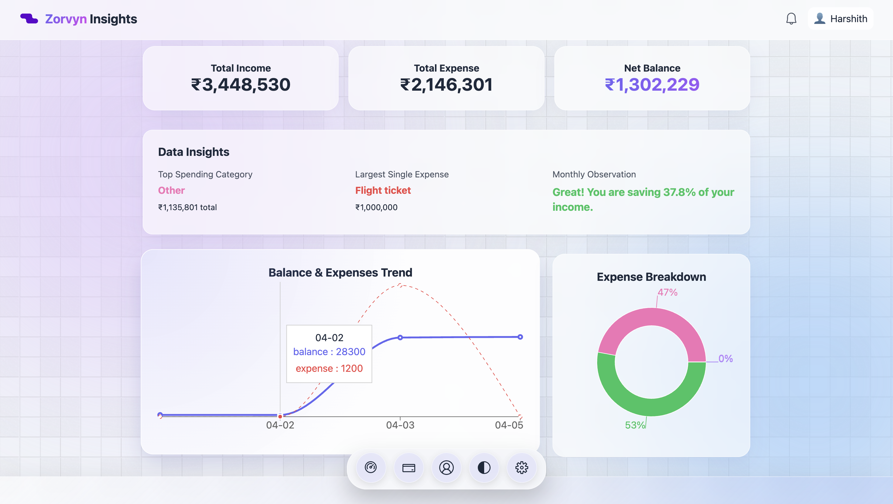
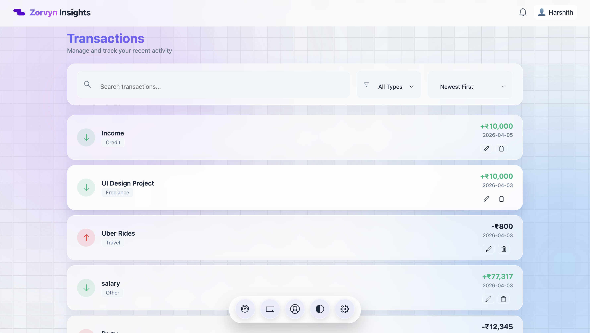
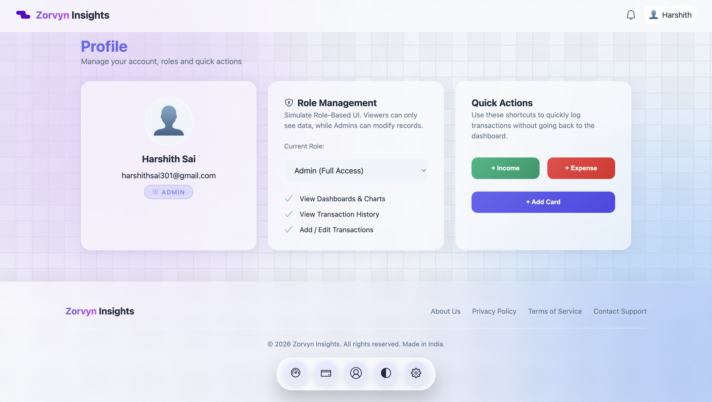
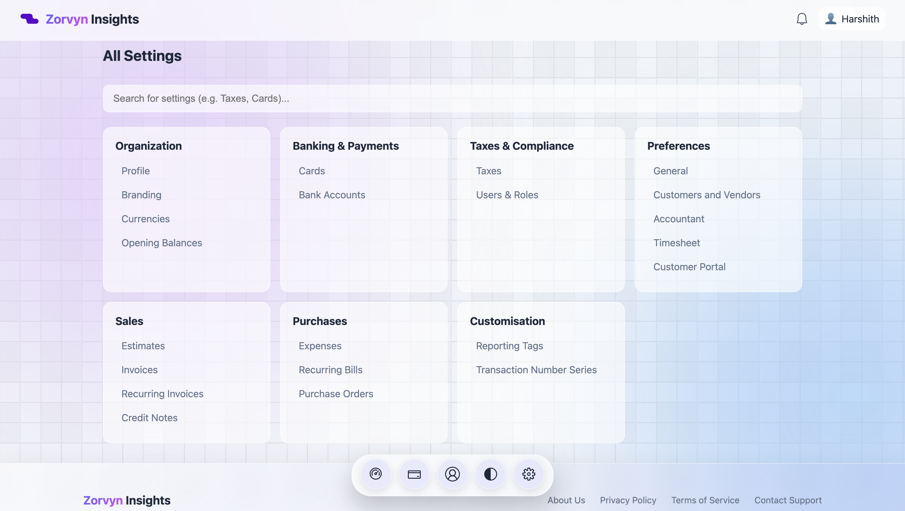

# Zorvyn Insights

A modern, interactive finance dashboard built to track income, expenses and financial insights with a clean UI and smooth user experience.

## Overview

Basically Zorvyn Insights is a frontend-focused finance dashboard designed to demonstrate:

1. UI/UX design thinking and creativity
2. Components-based architecture
3. State management
4. Interactive data visualization
5. Local Storage

This project simulates a real-world financial tracking application without backend.

## Features

### Dock

1. macOS-inspired bottom navigation dock
2. Smooth hover magnification effect
3. Tooltip labels for better usability
4. Inspired by UI Components from ReactBits.dev

### Dashboard

1. Total Income, Expenses and Balance cards
2. Time-based chart (Balance & Expense trends) --> Graph
3. Category-based chart (Spending breakdown) --> Pie Chart
4. Smart insights:
5. Highest spending category
6. Largest expense
7. Savings observation(Percentage wise --> Good or Bad)

---

### Transactions

- View all transactions with:
  1. Date
  2. Amount
  3. Category & Description
  4. Type (Income / Expense)

- Features:
  1. Search among transactions
  2. Filter by type
  3. Sorting

### Role-Based UI

- Simulated roles:
  1. **Admin** --> Can add, edit and delete
  2. **Viewer** --> Read-only access

### Quick Actions

1. Add Income or Expense directly from Profile
2. Instant updates across dashboard and charts
3. Add Cards(Credit or Debit cards)

### Insights Engine

- Automatically calculates:
  1. Spending patterns
  2. Savings rate
  3. Key financial observations

### Settings System

1. Interactive settings UI
2. Cards management (Add/Edit/Delete cards)
3. Currency, tax, and preference sections(No backend)

### UI & UX Highlights

1. Glassmorphism design
2. Gradient-based modern UI
3. Animated dock navigation (macOS-inspired)
4. Smooth transitions using Framer Motion
5. Dark / Light theme support

### Data Persistence

- Uses **LocalStorage** to store:
  1. Transactions
  2. Cards
  3. User state
  4. Dashboard content and Insights

## Tech Stack

1. **React.js**
2. **Framer Motion** (for smooth animations)
3. **Recharts** (for data visualization)
4. **CSS (custom styling)**
5. **React Icons** (For Icons)

## Project Structure

```
src/
│── pages/
│   ├── Dashboard.jsx
│   ├── Dashboard.css
│   ├── Transactions.jsx
│   ├── Transactions.css
│   ├── Profile.jsx
│   ├── Profile.css
│   ├── Settings.jsx
│   ├── Settings.css
│   ├── Dock.jsx
│   ├── Dock.css
│
│── App.jsx
│── index.css
```

## Setup Instructions

1. Clone the repository:

```
git clone https://github.com/HarshithMaddela/zorvyn-dashboard.git
```

2. Navigate into the project:

```
cd finance-dashboard
```

3. Install dependencies:

```
npm install
```

4. Run the development server:

```
npm run dev
```

## Screenshots

### Dashboard



### Transactions



### Profile



### Settings



## Approach & Thought Process

This project was designed with a focus on:

1. **User experience first** → intuitive navigation and interactions
2. **Component modularity** → reusable and scalable structure
3. **State-driven UI** → all views react to data changes
4. **Clean design** → minimal, readable and modern

Special attention was given to:

1. Real-time data updates
2. Interactive and responsive layout
3. Smooth and role based UI and Theme

## Conclusion

This project demonstrates how a frontend application can be structured, styled and made interactive using modern tools and best practices.

## Author

Harshith Sai

## License

This project is for evaluation and learning purposes.
